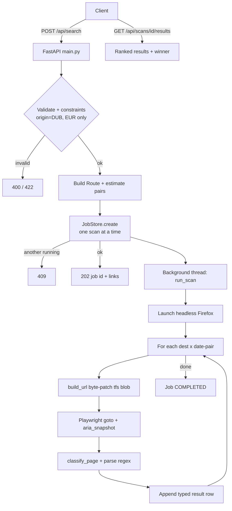
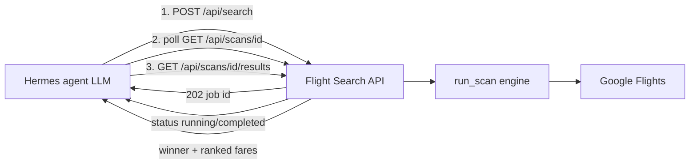
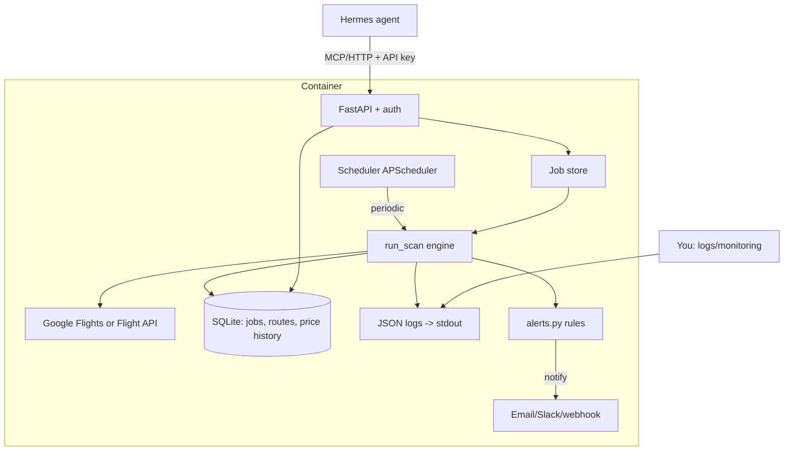

# How To Use Me — FareSweep Full Project Guide & Improvement Plan

> A beginner-friendly but technically detailed walkthrough of **FareSweep** (formerly
> the Cairo-Dublin search prototype, `CAI-2-DUB-SEARCH`): what it does, how it's built,
> how reliable it is, how to maintain it, and how to extend it. This document was
> produced by a deep read of the actual source code — file paths and function names are
> cited so you can follow along.

---

## 1. High-level summary

**What it is (plain English):** This is a **flight price scanner** for cheap round-trip flights *out of Dublin (DUB)*. You tell it a destination (e.g. Cairo, Istanbul) and a range of dates, and it checks **Google Flights** for every valid departure/return date combination in that range, then reports the cheapest fare it found.

**The problem it solves:** Google Flights can't answer "what's the cheapest round trip if I'm flexible across these 60 days, but only want to fly on weekends, for a 3–14 day trip?" This tool brute-forces that by generating one Google Flights search URL per date pair and reading the price off each page.

**Main workflow (start to finish):**
1. A client sends an HTTP request (`POST /api/search`) with a destination and date parameters.
2. The API builds an internal `Route` object and calculates how many `(destination × date-pair)` combinations it needs to check.
3. It creates a background **job** and immediately returns a job ID (HTTP `202`) — it does *not* wait, because a scan takes minutes.
4. A background thread launches a **headless Firefox browser** (via Playwright), visits each generated Google Flights URL, and scrapes the price using text pattern matching.
5. The client polls `GET /api/scans/{id}` for progress and `GET /api/scans/{id}/results` for the ranked list + cheapest "winner."

**Inputs:** destination airport code(s), date window, trip-length range, allowed weekdays, currency, optional airline name filter.

**Outputs:** JSON — a list of scanned date pairs each with a price (or a typed reason it had no price), ranked cheapest-first, plus a single "winner."

**Production-ready or experimental?** It's a **solid prototype / early-production** service. It has good error handling, resilience logic, and 78 tests — better than most AI-generated code. **But** it is *not* yet suitable for reliable 24/7 unattended operation because: (a) it depends on scraping Google Flights (fragile by nature), (b) job state lives only in memory and is lost on restart, (c) there is no scheduler, (d) logging is set up but effectively invisible by default, and (e) it's hardcoded to Dublin as the origin. More on all of these below.

**Important:** There is **no LLM anywhere** in this project. It's pure deterministic Python. So the goal of "run reliably without an LLM for judgment" is essentially already satisfied — see §5 for the nuance.

---

## 2. Project structure

The real application lives entirely in the `app/` folder. Everything at the repo root is either a CLI convenience script, cached data, config, or docs.

| File/Folder | Purpose | Importance |
|---|---|---|
| `app/main.py` | The **FastAPI app** and every HTTP endpoint (health, search, scans, routes, saved-trips). Defines request models (`SearchRequest`, `ScanCreate`, `RouteCreate`). | **Core / API** — the front door |
| `app/engine.py` | The **brain**. Builds Google Flights `tfs=` URLs from captured protobuf blobs, drives Playwright/Firefox, parses prices, classifies pages, runs the scan loop (`run_scan`). Defines the `Route` dataclass. | **Core logic** — most important file |
| `app/registry.py` | The **route store**. Loads built-in routes from `routes.json`, manages user-created routes in `routes.user.json`, validates them. | **Core logic** — route management |
| `app/jobs.py` | **In-memory job store** + background worker threads. Manages job lifecycle (queued→running→completed/failed/cancelled), the "one scan at a time" lock, and cancellation. | **Core logic** — concurrency/state |
| `app/scanner.py` | Tiny **adapter** connecting the job store to the engine. ~30 lines. | **Core (glue)** |
| `app/browser_env.py` | Picks a Firefox build that matches the installed Playwright (avoids a macOS crash). | **Core (infra)** |
| `app/routes.json` | The **3 built-in routes** as data: `turkey`, `egyptair`, `ams`. Git-tracked. | **Configuration/data** |
| `app/routes.user.json` | User-created routes (gitignored, container-local, lost on rebuild). | **Configuration/data (runtime)** |
| `cheapest_dub_cai_egyptair.py`, `cheapest_dub_turkey.py`, `cheapest_dub_ams.py` | **CLI wrappers** over the same engine. Handy for one-off runs; also exercised by tests. | **Optional entrypoints** |
| `results*.json`, `dub_turkey_*.json` | Cached sample scan outputs, served by `GET /api/saved-trips`. | **Sample data** (large; see §11) |
| `Dockerfile` | Builds the image from Microsoft's Playwright-python base (Firefox pre-installed). Includes a healthcheck. | **Deployment** |
| `docker-compose.yml` | Runs the container on `127.0.0.1:8010`, `restart: unless-stopped`. | **Deployment** |
| `.env.example` | Config template: `PORT`, `HOST`, `ALLOWED_ORIGINS`, `PLAYWRIGHT_BROWSERS_PATH`. | **Configuration** |
| `scripts/dev.sh` | Local dev runner: creates venv, installs deps, runs uvicorn with autoreload. | **Dev tooling** |
| `requirements.txt` / `requirements-dev.txt` / `pyproject.toml` | Dependencies + ruff lint config. | **Configuration** |
| `README.md` | Main documentation. Good but has some drift (see §10). | **Documentation** |
| `docs/API.md` | Detailed HTTP API reference. Accurate. | **Documentation** |
| `docs/openapi.json` | Static copy of the OpenAPI spec. | **Documentation** |
| `docs/INVENTORY.md` | A deep internal engineering audit with acceptance criteria (AC1–AC5). Very useful but has **stale line numbers** post-refactor. | **Documentation (technical)** |
| `app/route_defs.py` | Backward-compat shim; re-exports built-in routes for the CLI/tests. | **Core (compat)** |
| `tests/` | 78 test functions + recorded page fixtures. All run offline (no live browser). | **Testing** |

---

## 3. How the tool works internally

**Where execution starts:** `app/main.py`. When uvicorn imports it, line 30 calls `prepare_playwright_browsers()` to fix the browser path, then FastAPI registers all endpoints.

**The two entry paths** (they converge on the same engine):
- `POST /api/search` (`main.py:270`) — an **ad-hoc** search. Builds a throwaway `Route` on the fly from the request body via `_build_search_route` (`main.py:238`).
- `POST /api/scans` (`main.py:339`) — runs a **saved** route by its id, looked up in the registry.

**Step-by-step flow for a search:**
1. **Validate** the request (`SearchRequest` Pydantic model, `main.py:90`). Bad input → HTTP `422`.
2. **Enforce constraints** (`main.py:277`): origin must be `DUB` else `400`; currency must be `EUR` else `422`.
3. **Build the Route** (`_build_search_route`) — normalizes destination codes, caps at 5.
4. **Estimate work** via `estimate_pairs` (`engine.py:472`) = number of date pairs × number of destinations. If 0 → `422`; if over `MAX_PAIRS_PER_SCAN` (1500) → `422`.
5. **Create the job** (`store.create`, `jobs.py:107`). If a scan is already running → `409`. Otherwise a `ScanJob` is created with a UUID and status `QUEUED`.
6. **Spawn a worker thread** (`store.start_worker`, `jobs.py:169`) that calls `run_scan`.
7. **Return `202`** immediately with `links` (status/results/cancel) and `capability_notes`.

**Inside `run_scan` (`engine.py:793`) — the actual scraping loop:**
1. Enumerate all `(dep, ret)` date pairs (`enumerate_pairs`, `engine.py:423`) and destinations.
2. Launch headless Firefox (`_launch_firefox`, `engine.py:672`) with DNS-over-HTTPS prefs.
3. **Warm-up:** load the Google Flights homepage, dismiss the EU consent wall once (`_reject_consent`), and check for an anti-bot wall before starting.
4. For each destination × date pair:
   - Build the URL — `build_nonstop_url` for nonstop routes, otherwise `build_url` (`engine.py:181`). This **byte-patches a captured protobuf blob** (`BASE_TFS`) — swapping in the new dates and destination code.
   - `_scan_one_pair` (`engine.py:696`) navigates, waits, snapshots the page's accessibility tree (`aria_snapshot()`), and parses prices with regex.
   - `classify_page` (`engine.py:503`) assigns a **typed outcome**: `priced`, `empty`, `loading`, `drift_suspected`, `provider_error`, `wall_consent`, `wall_signin`, `wall_captcha`, `timeout`, `parse_error`, `error`.
   - Retries `loading`/`provider_error` with exponential backoff; **aborts the whole scan** if it hits a sign-in or CAPTCHA wall (`ScanBlocked`).
   - Appends one result row (with its `outcome`) to `job.results`.
5. On finish, the worker marks the job `COMPLETED` (or `FAILED`/`CANCELLED`).

**How data is stored/returned:** Everything is **in-memory** in the `JobStore` (`jobs.py:70`). Results are ranked on read by `/api/scans/{id}/results` (`main.py:389`), which filters priced rows and sorts ascending.

**How errors are handled:** Very deliberately. Each page gets a *typed outcome* so an empty result is never confused with a blocked page. Per-pair failures become a single error row and the scan continues; session-fatal walls abort the scan; the worker catches `BaseException` so a job never gets stuck `RUNNING`.

**What's hardcoded:** The origin (Dublin), the captured protobuf blobs including the nonstop-Cairo and one-way-Cairo→Dublin blobs, the seed dates inside them, EUR-only parsing, and Turkey's fixed August-2026 date list. Details in §4.



---

## 4. Route/destination tracking

**Is it limited to Cairo↔Dublin?** **The origin is hard-locked to Dublin (DUB). The destination is NOT limited** — you can already scan Dublin → many destinations. But there are important asterisks:

**What's supported today:**
- **Origin:** *only* `DUB`. Enforced in three places: `LOCKED_ORIGIN = "DUB"` (`registry.py:31`), and explicit `400` checks in `main.py:195` (create route), `main.py:277` (search), plus `RouteCreate.origin` default (`main.py:143`).
- **Destinations (round trip, any airline):** essentially arbitrary 3-letter IATA codes, 1–5 per route. This works because the destination is stored as literal ASCII inside the captured blob, so `build_url` can byte-swap `CAI` for e.g. `IST` (`engine.py:211`).
- **Nonstop search:** *only* `DUB → CAI` (Cairo). Enforced in `Route.__post_init__` (`engine.py:368`) — the nonstop blob has Cairo baked in as a Google "knowledge-graph ID," not ASCII, so it can't be swapped.
- **One-way `CAI → DUB`:** a builder exists (`build_oneway_url`, `engine.py:297`) but is **not wired to any API endpoint** — only tests use it. It's effectively dormant code.

**Where routes are defined:**
- Built-in routes: **`app/routes.json`** (data file, git-tracked) — `turkey`, `egyptair`, `ams`. Loaded by `registry.py:129`.
- User routes: **`app/routes.user.json`** (created via `POST /api/routes`, gitignored, lost on image rebuild).
- Ad-hoc routes: constructed per-request and never saved.

**Are they hardcoded?** The **route definitions** are *data*, not code (a genuine refactor happened; see commit `7e69719 "routes are data, not code"`). But the **origin** and the **URL-building blobs** are hardcoded in `engine.py`:
- `BASE_TFS` (`engine.py:59`) — captured DUB↔CAI round-trip blob; Dublin encoded as `/m/02cft`.
- `NONSTOP_CAIRO_TFS` (`engine.py:235`) — Dublin *and* Cairo baked in.
- `ONEWAY_CAI_DUB_TFS` (`engine.py:289`).
- `SEED_DEP`/`SEED_RET`/`SEED_DEST`/`SEED_AIRLINE` — the literal strings that get byte-swapped.

**How config flows in:** From API request body → `config` dict → `enumerate_pairs`/`destinations_for`. There's no database, no CLI-args-to-server, no env-var-driven routing. Routes come from JSON files or HTTP requests.

**What must change to support arbitrary origins/routes:** The blunt limitation is that the tool **reverse-engineers Google's URL format by patching a captured blob** rather than *generating* it. To support arbitrary origins you'd need one of:
1. **A proper `tfs=` protobuf builder** — encode origin/destination as knowledge-graph IDs from scratch. This is what the code calls "Phase 4." You'd need a mapping of airport code → knowledge-graph ID (`DUB`→`/m/02cft`, `CAI`→`/m/01w2v`), which you'd have to build/capture. Medium-hard.
2. **Switch to a real flight-data API** (e.g. an aggregator like Kiwi/Tequila, Amadeus, Duffel, or a SerpAPI Google-Flights endpoint). This removes scraping fragility entirely and makes origins/destinations trivial — but costs money and changes the whole engine. This is the cleanest long-term path.

**Risks/edge cases when going universal:**
- **Knowledge-graph IDs** aren't 3-letter codes; you need a reliable lookup table or you'll silently search the wrong city.
- **Currency:** the parser only reads `"euros"` labels (`engine.py:491`), so non-EUR pages return zero prices. Universal routes need currency-aware parsing.
- **Scale/rate limits:** more routes × more dates = more Google page loads = more chance of CAPTCHA/anti-bot walls (the code already handles these as typed states, but they'll happen more often).
- **Provider drift:** the byte-patching depends on Google's exact protobuf schema; the code already documents that the airline-filter bytes broke in 2026-06 (`engine.py:196`). This will keep happening.

---

## 5. LLM usage

**There is no LLM in this project.** A search for every common provider/library (OpenAI, Anthropic, Claude, GPT, LangChain, embeddings, completions) found **zero** references in any source, config, or dependency file.

- **Is an LLM used?** No.
- **Provider/model?** None.
- **Where does the "judgment" happen?** In pure deterministic Python: `classify_page` (`engine.py:503`) makes all the decisions using URL checks, string matching, and regex. Ranking is a simple sort by price (`jobs.py:51`, `main.py:397`).
- **Is an LLM necessary?** No — and it should stay that way. Price comparison and page classification are exactly the kind of thing that should be deterministic rules, not an LLM (cheaper, faster, testable, reproducible).
- **How to replace an LLM with deterministic logic?** N/A — it's already deterministic.

**The nuance for Hermes:** The *tool* has no LLM, but presumably **Hermes agent itself is the LLM**. The right architecture is: keep this tool 100% deterministic, and let Hermes (the LLM) *decide when to call it and how to interpret results* — but never let the LLM be in the loop for the actual scanning/decision logic. What should remain human-reviewable: the captured blobs and the price thresholds/alert rules you eventually add (see §12 Phase 3).

---

## 6. How to make it run 24/7

**Is the current code suitable for 24/7?** Partially. It's a long-running FastAPI server that can stay up (Docker `restart: unless-stopped` already helps). But **it has no scheduler** — it only scans when someone calls the API. And **it's stateful in memory**, so a restart loses all job history. It's an on-demand service, not an autonomous monitor.

**What would break if it "ran continuously" as-is:**
- **Job state is lost on restart** (`jobs.py:72`, in-memory dict). No persistence.
- **User routes vanish on image rebuild** (`registry.py` docstring admits this).
- **No dedup** — nothing stops you re-scanning the same route repeatedly and wasting Google page loads.
- **One scan at a time** (`jobs.py:109`) — a scheduler firing overlapping scans would just get `409`s.
- **Logs effectively invisible** (see §7), so you couldn't tell what happened overnight.

**What it needs to become an autonomous monitor:**
- A **scheduler** to trigger scans on an interval (e.g. "check Dublin→Cairo every 6 hours").
- **Persistent state** (a small database) to remember the last price per route and detect changes.
- **Retry + backoff** on transient failures (partially exists per-pair; needs a job-level retry).
- **Rate-limit friendliness** — spread scans out, respect the CAPTCHA-abort signal, cool down after a wall.
- **Dedup / locking** — don't start a scan if one is running or ran recently.

**Recommended deployment options (ranked for this project):**

| Option | Fit | Notes |
|---|---|---|
| **Docker container + internal scheduler (APScheduler) — RECOMMENDED** | Best | You already have a working container. Add an in-process scheduler thread that periodically calls the same `run_scan`, plus SQLite for state. Single artifact, easy to run on any VPS. |
| **Docker + external cron calling the API** | Good, simple | A host cron does `curl -X POST .../api/search` on a schedule. Zero code change, but state/alerting still missing. Good stopgap. |
| **systemd service** (bare Python, no Docker) | OK | `systemd` gives auto-restart + logs via journald. Works but you lose the bundled Firefox from the Playwright image; you'd manage Playwright yourself. |
| **Celery/Redis background worker + beat scheduler** | Overkill now | Proper distributed queue with scheduling and retries. Great if you scale to many routes/workers later, but heavy for a single-browser scraper. |
| **Serverless (Lambda/Vercel functions)** | **Bad fit** | Scans run for minutes and need a persistent browser — the README correctly says it's "not serverless-friendly." |

**Best for this project:** **Docker container + APScheduler + SQLite**. It builds directly on what exists (the container already restarts on crash), adds scheduling and persistence with minimal new infrastructure, and keeps everything in one deployable unit.

**Crash handling:** `docker-compose.yml` already has `restart: unless-stopped` and the Dockerfile has a `HEALTHCHECK` (`Dockerfile:19`). Add a supervisor/scheduler that re-queues missed runs after a restart.

**Rate limits:** treat `wall_captcha`/`wall_signin` outcomes (the code already detects these) as a signal to **pause the scheduler** for a cooldown period, not just fail one job. Randomize scan timing.

**Retries:** add job-level retry (re-queue a `FAILED` scan once after a delay), on top of the existing per-pair retry.

**Avoid duplicate work:** persist "last scanned at" per route; the scheduler skips routes scanned within the interval. The `409` single-active gate already prevents concurrent scans.

**Persist state:** move `JobStore` and route registry to SQLite (or Postgres if Hermes needs shared access).

**Polling intervals:** make it a config value (env var or per-route field), e.g. `SCAN_INTERVAL_MINUTES`.

**Stop/start/restart safely:** `docker compose up -d` / `stop` / `restart`. Because scans are between-pair-cancellable, a graceful shutdown should signal cancellation and let the current pair finish.

---

## 7. Logging and observability

**Current situation — this is a trap:** The code *looks* like it has excellent logging. `engine.py`, `jobs.py`, and `registry.py` all use named loggers (`dub.engine`, `dub.jobs`, `dub.registry`) and emit rich structured records with `extra={...}` fields (job_id, route_id, dest, dep, ret, url, attempt, snapshot_len, match_count, min_price, outcome, elapsed_ms) — see `engine.py:917`.

**But there is no logging configuration anywhere.** Confirmed: **no `logging.basicConfig`, no handlers, no formatters, no dictConfig, no log-level setup** exists in the entire project. This means:
- By default, Python's root logger only shows **WARNING and above**, so all those detailed `log.info("scan pair", ...)` records at INFO level are **silently dropped**.
- Even the ones that do print (warnings/errors) go through the default formatter, which **ignores the `extra={...}` fields entirely** — so the structured data (url, outcome, elapsed_ms) never actually appears in output.
- Under uvicorn, these named loggers aren't attached to uvicorn's handlers either.

So: **the logging is written but not wired up.** `docs/INVENTORY.md` even flagged "The scan path currently has NO logging" as AC3 — the code was then instrumented, but the final step (configuring output) was never done.

- **Do logs exist?** The *calls* exist; the *output* effectively doesn't.
- **Where are logs written?** Nowhere by default (dropped/formatted-away).
- **Are errors logged properly?** `log.exception(...)` calls exist (`jobs.py:191`, `engine.py:689`) and would print tracebacks, but without the `extra` fields.
- **Successful runs?** Logged at INFO → invisible by default.
- **Useful enough to debug?** No, not until configured.

**Proposed logging system (small, high-impact):**

Add a logging setup at app startup (in `main.py`) that:
1. Sets level to INFO (or configurable via `LOG_LEVEL` env var).
2. Attaches a **JSON formatter** that serializes the `extra` fields.
3. Writes to stdout (so Docker/journald/cloud log collectors capture it) — and optionally a rotating file.

The loggers already emit exactly the events you want. A JSON-lines format would give you entries like:

```json
{"ts":"2026-07-02T09:00:01Z","level":"INFO","logger":"dub.engine","event":"scan start","job_id":"1ef4b4c8","route_id":"egyptair","dests":["CAI"],"pairs":48,"total":48}
{"ts":"2026-07-02T09:00:14Z","level":"INFO","logger":"dub.engine","event":"scan pair","job_id":"1ef4b4c8","route_id":"egyptair","origin":"DUB","dest":"CAI","dep":"2026-08-01","ret":"2026-08-08","url":"https://www.google.com/travel/flights/search?tfs=...","attempt":0,"snapshot_len":18422,"match_count":6,"min_price":712,"outcome":"priced","elapsed_ms":9130}
{"ts":"2026-07-02T09:00:22Z","level":"WARNING","logger":"dub.engine","event":"pair failed","job_id":"1ef4b4c8","dest":"CAI","dep":"2026-08-04","ret":"2026-08-11","outcome":"timeout","elapsed_ms":45000}
{"ts":"2026-07-02T09:05:03Z","level":"INFO","logger":"dub.engine","event":"scan end","job_id":"1ef4b4c8","done":48,"total":48,"priced":41,"unpriced":7}
```

This directly covers everything on the wishlist: tool start (`scan start`), route/destination being checked (`dest`/`route_id`), which URL was called (`url`), success/failure (`outcome`), result found (`min_price`), retry attempts (`attempt`), runtime (`elapsed_ms`), and per-run summary (`scan end` with priced/unpriced tally). The only thing not yet emitted is **"did the price change vs last run?"** — that requires persistence (see §6), after which you'd add a `price_changed` field.

You could use the stdlib with a custom formatter, or add `python-json-logger` (one small dependency).

---

## 8. API analysis

**Yes, there is already a real, well-documented API.** Framework: **FastAPI**, defined in `app/main.py`. Interactive Swagger docs at `/docs`, spec at `/openapi.json`, reference in `docs/API.md`.

**Existing endpoints:**

| Method & Path | What it does | Inputs | Outputs |
|---|---|---|---|
| `GET /api/health` | Liveness probe | none | `{status, version, provider}` |
| `POST /api/search` | Ad-hoc search (background job) | destinations, dates, weekdays, currency, airline_name, nonstop | `202` + job handle + `links` + `capability_notes` |
| `POST /api/scans` | Run a **saved route** by id | `route_id`, date window overrides | job dict |
| `GET /api/scans` | List recent jobs (≤20) | none | job list |
| `GET /api/scans/{id}` | Job status/progress/current best | path id | job dict |
| `GET /api/scans/{id}/results` | Full + ranked results + winner | path id | `{results, ranked, winner}` |
| `POST /api/scans/{id}/cancel` | Cancel a job | path id | `{status:"cancelled"}` |
| `GET /api/routes` | List built-in + user routes | none | route objects with `combinations` estimate |
| `POST /api/routes` | Create a user route | destinations, airline, weekdays, etc. | `201` route object |
| `DELETE /api/routes/{id}` | Delete a user route | path id | `{status:"deleted"}` |
| `GET /api/saved-trips` | Best fares from cached sample files (no scan) | none | ≤6 trip objects |

**Authentication?** **None.** There is no API key, token, or auth middleware anywhere. CORS defaults to `*` (`main.py:59`).

**Safe to expose to another agent/external service?** For a **trusted internal** consumer (like Hermes on the same network/host), yes — the API is clean, validated, and can't be tricked into scanning arbitrary origins. For **public exposure**, no, not as-is: no auth, no rate limiting, and each request can trigger a minutes-long browser scan (a trivial denial-of-service — someone could just fire many searches, though the `409` gate limits it to one at a time). The `docker-compose.yml` wisely binds to `127.0.0.1` only and the README says to "front this with a reverse proxy."

**The API design is genuinely good** — you don't need to redesign it. The async job pattern (`202` + poll) is the correct choice for long scans. The main gaps to add for your goals:
- `GET /api/status` (scheduler state, last-run-per-route, health details)
- `GET /api/logs` or a run-history endpoint (needs persistence)
- Optional API-key auth for Hermes
- A `POST /routes/check` synchronous-ish convenience wrapper (or let Hermes use the existing async flow)

Example of the existing search request/response (from real code):

```bash
curl -s -X POST http://localhost:8000/api/search \
  -H 'Content-Type: application/json' \
  -d '{"destinations":"CAI","nonstop":true,"weekdays":"Sat,Sun,Tue,Thu"}'
```
```json
{
  "id": "1ef4b4c8-c95a-4f52-8f24-e2afe50a5fcc",
  "route_id": "cai",
  "status": "queued",
  "total": 48, "done": 0, "progress_pct": 0.0,
  "links": {"status": "/api/scans/1ef4b4c8.../","results": "/api/scans/1ef4b4c8.../results","cancel": "/api/scans/1ef4b4c8.../cancel"},
  "capability_notes": ["origin pinned to DUB", "nonstop search uses the fresh DUB->Cairo blob (EgyptAir is the only nonstop carrier)"]
}
```

---

## 9. Hermes agent integration

**Can Hermes call it now?** Yes — via the HTTP API, immediately, with no changes. That's the cleanest path.

**Recommended integration method:** **HTTP API** (not a CLI or direct Python import). Reasons: the API already exists, is documented with an OpenAPI spec, enforces validation/safety, and decouples Hermes from the scraper's process/dependencies (Playwright, Firefox). A CLI call would block for minutes and give you no structured progress; a direct Python import would couple Hermes to the browser runtime.

**Best architecture:**


Wrap the API as an **MCP tool** (or a plain function tool) so Hermes calls it structurally. Example tool schema:
```json
{
  "name": "search_flights",
  "description": "Search cheapest round-trip fares out of Dublin (DUB) over a date window. Returns a job id; poll get_flight_results.",
  "input_schema": {
    "type": "object",
    "properties": {
      "destinations": {"type": "array", "items": {"type": "string"}, "description": "1-5 IATA codes"},
      "start": {"type": "string", "description": "YYYY-MM-DD, earliest departure"},
      "window_days": {"type": "integer", "default": 60},
      "min_trip_days": {"type": "integer", "default": 3},
      "max_trip_days": {"type": "integer", "default": 14},
      "weekdays": {"type": "string", "default": "Sat,Sun,Tue,Thu"},
      "nonstop": {"type": "boolean", "default": false},
      "airline_name": {"type": "string"}
    },
    "required": ["destinations"]
  }
}
```

**Inputs Hermes sends:** destination(s) + date preferences (as above). Note: Hermes must **not** send a non-DUB origin or non-EUR currency (they'll get rejected).

**Outputs Hermes receives:**
- From `POST /api/search`: a job id + `links` + `capability_notes` (Hermes should surface the notes to the user, e.g. "origin pinned to Dublin").
- From `GET /api/scans/{id}/results`: `winner` (cheapest row: price, dep/ret dates, airline) and `ranked` list.

**Errors Hermes should expect:** `400` (bad origin/nonstop/IATA), `409` (a scan is already running — Hermes should back off and retry), `422` (bad params or zero date pairs), `404` (unknown job/route). Also: a job can finish `COMPLETED` but with `winner: null` if no fares were found — Hermes should check the row `outcome` fields to explain *why* (e.g. all `wall_captcha`).

**How Hermes checks status/logs:** `GET /api/scans/{id}` for progress; after you add persistence + a logs/status endpoint (§7/§8), `GET /api/status` and `GET /api/logs`/run-history.

**Recommended:** since you already use MCP heavily, wrap these endpoints as a small **MCP server** (or reuse an existing HTTP-to-MCP bridge) so Hermes gets typed tools with schemas. Add an **API key** header before Hermes talks to it over any non-loopback network.

---

## 10. Documentation review

**What exists:** `README.md` (thorough), `docs/API.md` (accurate endpoint reference), `docs/openapi.json` (static spec), `docs/INVENTORY.md` (deep internal audit).

**Overall accuracy:** Good — better than typical. But there are specific drifts:

| Doc | Issue | Severity |
|---|---|---|
| `README.md:275` | Says "**33 tests**." Actual count is **78 test functions** across 12 files. Outdated. | Low |
| `docs/INVENTORY.md` | Line-number citations (e.g. "`main.py:151-154`", "`engine.py:502-605`") are **stale** — they don't match the current post-refactor line numbers. The *content* is still largely valid but the pointers will mislead. | Medium |
| `docs/INVENTORY.md:186` | References a project-level **`CLAUDE.md`** for the Firefox DNS setting — **that file doesn't exist** in the repo. Dangling reference. | Low |
| `docs/INVENTORY.md` §8 vs §9 | §8 lists "top resilience defects" as if present; §9 says they're "now fixed." A new reader will be confused about which state is current (they *are* fixed in code). | Medium |
| `README.md` config table | Lists `PORT`/`HOST` as env vars, but they're **not read in `app/` code** — only by the Dockerfile/uvicorn CMD. Minor but the INVENTORY itself flags this. | Low |
| `README.md` / `docs/API.md` | The **one-way CAI→DUB** capability (`build_oneway_url`) is undocumented and unreachable via API — either document it as internal or expose it. | Low |
| Everywhere | Docs don't mention that **logging is unconfigured/invisible** by default (§7). Users will assume logs work. | Medium |

**What's missing:** No operations/runbook doc, no explicit configuration reference beyond `.env.example`, no logging doc, no Hermes integration doc, no standalone architecture doc (the README has a good diagram but it's mixed in).

**What's confusing:** `INVENTORY.md` reads like an in-progress engineering ticket (AC1–AC5, "defects" then "fixed"). Great for an engineer, confusing as canonical docs.

**Suggested documentation structure:**
- `README.md` — keep, but fix the test count and add a "current limitations at a glance" box.
- `ARCHITECTURE.md` — the flow + module responsibilities (lift the diagram out of README).
- `SETUP.md` — local + Docker setup.
- `CONFIGURATION.md` — every env var + where it's actually read.
- `API.md` — keep (it's good); regenerate `openapi.json` when endpoints change.
- `OPERATIONS.md` — how to run 24/7, start/stop, handle CAPTCHA cooldowns, restart, monitor.
- `LOGGING.md` — the JSON log schema + how to enable/collect logs.
- `HERMES_INTEGRATION.md` — the tool schema + example calls from §9.

---

## 11. Weaknesses, risks, and bugs

| Issue | File/Location | Severity | Why it matters | Recommended fix |
|---|---|---|---|---|
| **Logging configured but never wired to output** | all app modules use loggers; no `basicConfig`/handlers anywhere | **High** | You can't debug or monitor a 24/7 scraper; INFO records (every scan pair) are silently dropped and `extra` fields never printed | Add a JSON logging setup at startup in `main.py`; level via `LOG_LEVEL` env (§7) |
| **Job state is in-memory only** | `jobs.py:72` (`self._jobs = {}`) | **High** | Restart/crash loses all jobs and history; blocks change-detection and 24/7 use | Persist to SQLite (jobs + last-price-per-route) |
| **No scheduler / autonomous runs** | (absent) | **High** | Tool only runs when called; can't monitor prices unattended | Add APScheduler thread or external cron (§6) |
| **Fragile scraping of Google Flights** | `engine.py` byte-patching + regex parsing | **High** | Google can change its protobuf schema or page layout anytime (already happened to the airline filter, `engine.py:196`); prices could silently stop parsing | Long-term: switch to a paid flight API; short-term: alert when priced-rate drops (drift detection already partly exists) |
| **Origin hardcoded to DUB + blobs baked in** | `registry.py:31`, `engine.py:59/235/289` | **Medium** | Can't support other origins; nonstop only DUB→CAI | Build a real `tfs=` protobuf generator + airport→KG-ID map, or use an API (§4) |
| **No API authentication / rate limiting** | `main.py` (no auth middleware); CORS `*` | **Medium** | Unsafe to expose publicly; anyone reachable can trigger minute-long scans | Add API-key header + reverse proxy; keep loopback binding |
| **User routes lost on image rebuild** | `registry.py` docstring; `routes.user.json` gitignored | **Medium** | Any routes Hermes/you create vanish on `docker compose up --build` | Persist routes in the DB or a mounted volume |
| **EUR-only parsing, silently** | `engine.py:491` `_PRICE_TOKEN_RE`; `main.py:283` rejects non-EUR | **Medium** | Non-EUR would return no prices; universal routes need this | Make the price regex currency-aware before enabling other currencies |
| **`adults` accepted but ignored** | `main.py:118`; blob encodes 1 adult | **Medium** | Returns prices for 1 adult even if user asks for more — misleading | Either reject `adults>1` or encode it in the blob; the capability note helps but is easy to miss |
| **Dormant/dead one-way code** | `build_oneway_url`/`parse_oneway` `engine.py:297/311` | **Low** | Unreachable from API; confuses maintainers | Expose via API or document as internal |
| **Large data files committed to git** | `results-egyptair-3months.json` (469KB), etc. | **Low** | Bloats the repo | Move sample data out of git or into a `samples/` dir; keep one small example |
| **Stale doc line numbers + missing CLAUDE.md ref** | `docs/INVENTORY.md` | **Low** | Misleads readers following citations | Regenerate/relabel; remove dangling `CLAUDE.md` reference |
| **Uncommitted test changes** | `tests/golden_urls.json` modified; `tests/test_date_swap.py`, `tests/test_oneway.py` untracked | **Low** | Working tree isn't clean; could lose work | Review and commit or discard |
| **Cancel only lands between pairs** | `engine.py:853/856`; a hung `goto` (up to 45s×4) ignores cancel | **Low** | Cancel/stop can take up to ~3 min to take effect | Acceptable; document it, or add a per-attempt cancel check |

**Good things worth noting (not bugs):** typed `ScanOutcome` classification (`engine.py:93`), write-once job state machine closing the cancellation race (`jobs.py`), job-store eviction cap (`jobs.py:16`), collision-safe date swap (`engine.py:161`), `MAX_PAIRS_PER_SCAN` guard (`engine.py:85`), browser teardown in `finally`, and 78 offline tests. This is careful engineering.

---

## 12. Improvement roadmap

### Phase 1 — Understand and stabilize
- **Wire up logging** (JSON to stdout, `LOG_LEVEL` env). Fix README test count. Clean the git working tree; commit or discard untracked tests.
- **Why:** you literally can't see what the tool does today; this unblocks everything else.
- Difficulty: Low · Risk: Low · Files: `app/main.py` (new logging setup), `README.md`, tests.

### Phase 2 — Make routes universal
- Decide origin strategy: build a real `tfs=` protobuf generator + airport→knowledge-graph-ID lookup, **or** adopt a flight-data API. Make currency parsing currency-aware.
- **Why:** removes the DUB-only and nonstop-CAI-only limits.
- Difficulty: High · Risk: High (touches the core URL/parsing engine, needs re-testing against goldens) · Files: `app/engine.py`, `app/registry.py`, `app/main.py`, tests.

### Phase 3 — Deterministic decisions (already mostly done)
- No LLM to remove. Instead, add **explicit rule/threshold config** for what counts as a "good deal" (e.g. `alert_below_price`, "cheaper than last run by X%"). Keep these human-editable and human-reviewable.
- **Why:** turns the scanner into a monitor that can decide when to alert — deterministically.
- Difficulty: Low–Medium · Risk: Low · Files: route model (`routes.json`/registry), a new `alerts.py`.

### Phase 4 — Logging and monitoring
- Add persistence (SQLite) so you can compute `price_changed` vs last run; add a run-history table; add `GET /api/status` and `GET /api/logs`/run-history endpoints.
- **Why:** debug failures, track trends, feed Hermes.
- Difficulty: Medium · Risk: Low–Medium · Files: `app/jobs.py`, new `app/store_db.py`, `app/main.py`.

### Phase 5 — Add/improve API
- Add API-key auth, optional rate limiting, the status/logs endpoints, and persist user routes in the DB.
- **Why:** makes it safe for Hermes/other systems.
- Difficulty: Medium · Risk: Low · Files: `app/main.py`, config, DB layer.

### Phase 6 — Hermes integration
- Wrap the API as an MCP tool (or function tool) with the schema from §9; document expected errors and the async poll pattern.
- **Why:** lets Hermes safely use the tool.
- Difficulty: Low–Medium · Risk: Low · Files: new `mcp_server.py` or tool wrapper, `HERMES_INTEGRATION.md`.

### Phase 7 — Production deployment (24/7)
- Add APScheduler for periodic scans, cooldown on CAPTCHA/sign-in walls, job-level retry, dedup via "last scanned at," and persistent volumes for the DB. Keep the Docker `restart: unless-stopped` + healthcheck.
- **Why:** run it unattended and reliably.
- Difficulty: Medium · Risk: Medium (scheduling + rate-limit behavior needs tuning) · Files: new `app/scheduler.py`, `docker-compose.yml`, config.

---

## 13. Suggested target architecture

**Recommended folder structure:**
```
app/
  main.py            # FastAPI endpoints (add auth, status, logs)
  engine.py          # scraping/URL engine (or api_client.py if you switch providers)
  registry.py        # routes (now DB-backed)
  jobs.py            # job store (now DB-backed)
  scheduler.py       # NEW: APScheduler periodic scans + cooldowns
  alerts.py          # NEW: deterministic deal rules + notifications
  logging_config.py  # NEW: JSON logging setup
  db.py              # NEW: SQLite/Postgres access
  routes.json        # built-in route seed data
config/
  .env               # PORT, HOST, ALLOWED_ORIGINS, LOG_LEVEL, API_KEY, SCAN_INTERVAL_MINUTES
docs/
  README / ARCHITECTURE / SETUP / CONFIGURATION / API / OPERATIONS / LOGGING / HERMES_INTEGRATION
data/                # mounted volume: flights.db (persistent state), sample results
tests/
```

**Config:** all runtime knobs as env vars (`LOG_LEVEL`, `API_KEY`, `SCAN_INTERVAL_MINUTES`, alert thresholds), route-specific settings in the DB.

**Route model (recommended fields):** `id, origin, destinations[], nonstop, one_way, airline_name, weekdays, min/max_trip_days, window_days, currency, scan_interval_minutes, alert_below_price, enabled, last_scanned_at, last_min_price`.

**API structure:** keep existing endpoints; add `GET /api/status`, `GET /api/runs` (history), `GET /api/logs`, API-key auth.

**Logging structure:** JSON lines to stdout, one record per lifecycle event (already emitted), collected by Docker/journald/cloud.

**State storage:** **SQLite** (single-file, zero-ops, perfect for one host). Upgrade to Postgres only if Hermes and the scanner run as separate services sharing state.

**Deployment:** single Docker container (scheduler + API in one process) with a mounted `data/` volume, behind a reverse proxy if exposed.



---

## 14. Questions to answer before changing code

These don't block anything; reasonable assumptions are noted.

1. **Origin scope:** Do you actually need origins other than Dublin, or is DUB-only fine? *Assumption: you want at least a few origins eventually.*
2. **Scraping vs paid API:** Willing to pay for a flight-data API (removes fragility, unlocks universal routes) or must it stay free-scraping? *Assumption: stay scraping for now, keep the option open.*
3. **Routes you care about:** Which specific origin/destination pairs matter most? *Assumption: Dublin↔Cairo is primary.*
4. **Alert behavior:** What triggers an alert — a fixed price threshold, a % drop vs last run, or just "new cheapest"? *Assumption: "below threshold OR cheaper than last run."*
5. **Where will it run?** A VPS you control, a cloud host, or a home server? *Assumption: a single VPS with Docker.*
6. **Hermes runtime:** Same host as the scanner, or remote? *Assumption: same host initially, add auth before remote.*
7. **Currencies:** EUR-only forever, or do you need others? *Assumption: EUR-only for now.*

---

## 15. Final summary

- **What it does now:** A FastAPI service that scrapes Google Flights (headless Firefox) to find the cheapest round-trip fares **out of Dublin**, scanning every valid date pair in a window, and returns ranked results via an async job API.
- **Hardcoded or flexible?** **Mixed.** Destinations are flexible/data-driven, but the **origin is hard-locked to Dublin**, nonstop is Cairo-only, and the URL engine depends on captured protobuf blobs. Not limited to just Cairo↔Dublin (you can already do DUB→many places), but it *is* Dublin-origin-only.
- **Does it have an API?** **Yes** — a clean, documented FastAPI with Swagger, but **no authentication**.
- **Can it run 24/7 now?** **Not reliably.** It stays up and restarts on crash, but has no scheduler, loses state on restart, and its logs are effectively invisible. It's on-demand, not autonomous.
- **Can Hermes use it now?** **Yes**, via HTTP immediately — but you should add an MCP/tool wrapper and an API key before relying on it.
- **Does it use an LLM?** **No** — it's fully deterministic already.

**Top 5 improvements to make first:**
1. **Turn on logging** (JSON to stdout) — the code already emits great structured events; they're just not wired to output. Highest value, lowest effort.
2. **Add persistence (SQLite)** for jobs, routes, and price history — unblocks change-detection and 24/7 use, and stops losing user routes on rebuild.
3. **Add a scheduler + cooldown** (APScheduler in the container) so it monitors prices autonomously and backs off when Google shows a CAPTCHA wall.
4. **Add API-key auth** before Hermes or anything external talks to it, and wrap it as an MCP tool.
5. **Decide the origin/provider strategy** (real `tfs=` builder vs a paid flight API) — this is the one big architectural fork that determines whether it can ever be truly universal.
